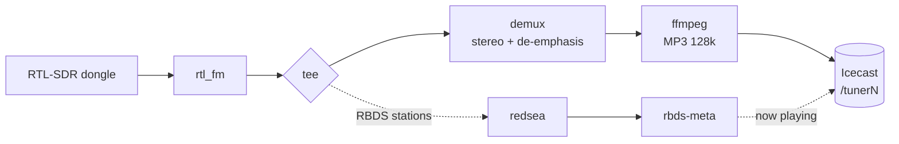

<p align="center">
  <picture>
    <source media="(prefers-color-scheme: dark)" srcset="docs/images/logo-dark.svg">
    
  </picture>
</p>

<p align="center">
  Turn cheap RTL-SDR dongles into internet radio stations.<br>
  A Raspberry Pi, one config file per station, and your own Icecast server.
</p>

<p align="center">
  
  
  
  
  <a href="LICENSE"></a>
</p>

<p align="center">
  <a href="#what-it-does">What it does</a> ·
  <a href="#how-it-works">How it works</a> ·
  <a href="#install-one-line">Install</a> ·
  <a href="#security">Security</a> ·
  <a href="#add-and-edit-stations">Stations</a> ·
  <a href="#rbds-now-playing-optional">RBDS</a> ·
  <a href="#configuration-reference">Config</a> ·
  <a href="#troubleshooting">Troubleshooting</a> ·
  <a href="#made-by">Made by</a>
</p>

> [!NOTE]
> **Pi-Tuner is a small, hobby-scale project.** A first install **resets your
> Icecast configuration** (new source and admin passwords), so back up Icecast
> first if you use it for other streams. Re-running the installer later is safe;
> it can [upgrade and keep your settings](#upgrading-and-changing-settings).

## What it does

Plug in a dongle, tune it to a frequency, and it streams that station to your
Icecast server. No web interface, no database: just a folder of text config
files and one Python program that systemd keeps running.

<table>
  <tr>
    <td>📻&nbsp;<b>FM&nbsp;and&nbsp;weather&nbsp;radio</b></td>
    <td>Stereo FM, plus NOAA Weather Radio in mono</td>
  </tr>
  <tr>
    <td>🔊&nbsp;<b>Icecast&nbsp;streaming</b></td>
    <td>Every station is a 128k MP3 stream on its own mount: <code>/tuner1</code>, <code>/tuner2</code>…</td>
  </tr>
  <tr>
    <td>🏷️&nbsp;<b>RBDS&nbsp;now-playing</b></td>
    <td>Shows <code>Artist - Title (PS)</code> in Icecast. The program type (PTY) becomes the genre (<code>Radio</code> if none; <code>Weather</code> for WX)</td>
  </tr>
  <tr>
    <td>⏺️&nbsp;<b>Recording</b></td>
    <td>Optionally saves any station as 128&nbsp;kbps MP3 files, cut every 15 minutes into dated folders</td>
  </tr>
  <tr>
    <td>♻️&nbsp;<b>Self-healing</b></td>
    <td>A station whose dongle or stream dies restarts automatically, with backoff</td>
  </tr>
  <tr>
    <td>🚨&nbsp;<b>EAS&nbsp;tone&nbsp;detection</b></td>
    <td>Listens for the 853 + 960 Hz attention tone and alerts you through Zabbix</td>
  </tr>
  <tr>
    <td>📟&nbsp;<b>Zabbix&nbsp;alerts</b></td>
    <td>Optional per-tuner items and alerts, with no agent on the Pi</td>
  </tr>
  <tr>
    <td>✉️&nbsp;<b>Email&nbsp;alerts</b></td>
    <td>Optional SMTP emails for station down/recovered, EAS tone, low disk space, and service start/stop</td>
  </tr>
  <tr>
    <td>⚙️&nbsp;<b>Easy&nbsp;upgrades</b></td>
    <td>Re-run the installer to upgrade and keep your settings; change them with <code>sudo pituner config</code></td>
  </tr>
  <tr>
    <td>🧰&nbsp;<b>One-line&nbsp;installer</b></td>
    <td>Installs everything, configures Icecast and walks you through your first stations</td>
  </tr>
</table>

## How it works



Each station gets its own dongle, `rtl_fm` pipeline and Icecast mount. The
supervisor in `tuner.py` watches every pipeline and restarts any that die.

## What you need

- A Raspberry Pi running Raspberry Pi OS (Debian).
- One RTL-SDR USB dongle per station you want to stream.
- An antenna for each dongle (a cheap telescopic antenna works for FM).

The installer handles everything else (software, Icecast, the FM and RBDS decoders).

## Install (one line)

Run this on the Pi:

```sh
curl -fsSL https://raw.githubusercontent.com/thetylerwoodwardproject/pi-tuner/main/install.sh -o /tmp/pituner-install.sh && sudo bash /tmp/pituner-install.sh
```

The installer asks before each step: packages, Icecast, dongle serials and your
first station or two. You can add more stations any time.

> [!WARNING]
> A first install (or **Fresh**) **resets your Icecast configuration** and
> restarts Icecast. Back up first if you use Icecast for other streams.

Already installed? Run the same command again to **Upgrade**, **Reconfigure** or
start **Fresh**; see [Upgrading and changing settings](#upgrading-and-changing-settings).

Prefer to look at the code first? Clone and run instead:

```sh
git clone https://github.com/thetylerwoodwardproject/pi-tuner.git
cd pi-tuner
sudo ./install.sh
```

## Security

> [!IMPORTANT]
> **We strongly recommend running Pi-Tuner under its own, separate user account**
> rather than your everyday login. It handles radio audio, talks to your network
> and holds passwords. These are recommendations; the installer doesn't enforce them.

- Don't run it as root, from the default `pi` user, or from your everyday
  account. Use a dedicated, unprivileged account named whatever you like.
- Change any default password before the Pi goes on a network.
- Ideally give Pi-Tuner a Pi of its own, off networks you don't trust. Keep
  Icecast's admin page, SSH and Zabbix reachable only internally, or behind a
  firewall or network segmentation.
- Keep the Pi updated (`sudo apt update && sudo apt full-upgrade`).

**Using Pi-Tuner in a broadcast environment? Follow the FCC password
guidelines.** The FCC's cybersecurity rules cover internet-connected devices in
the signal chain. In short ([SBE summary](https://sbe36.org/2025/12/fcc-urges-broadcasters-to-follow-cybersecurity-best-practices/)):

- passwords of **at least 15 characters**, with no dictionary words;
- **never reuse** a password on another account, device or service;
- **change default passwords** before the device is used on air;
- **change a password** if you think it has been compromised;
- install security patches and upgrades promptly, and limit remote access with a
  firewall or network segmentation.

Check the current FCC rules for exact requirements; this isn't legal advice.

Where the passwords are:

| Password | Notes |
|----------|-------|
| The Pi's own login, and SSH | Yours to set. Prefer SSH keys, and turn off password logins if you can. |
| Icecast source and admin | The installer generates 32 random characters for each, which meets the length rule. Don't reuse them. |
| Email (`smtp.conf`) | Use a long, unique password, or an app password from your mail provider. |
| Zabbix | Pi-Tuner holds no Zabbix password; protect your server the same way. |

`icecast.conf` and `smtp.conf` are plain text, readable only by the Pi-Tuner
account and root (mode 600), and `sudo pituner config` hides passwords as you
type. Not on air? Treat all of this as suggestions.

## Give each dongle a unique serial number

**Every RTL-SDR dongle ships with the same default serial** (usually
`00000001`), so with two or more plugged in the Pi can't tell them apart. Give
each its own, **one dongle at a time**:

1. Unplug all dongles, then plug in just **one**.
2. Write a new serial to it:
   ```sh
   sudo rtl_eeprom -d 0 -s 00001001
   ```
3. Unplug and replug it (the new serial only applies after a replug).
4. Confirm it worked:
   ```sh
   rtl_test
   ```
   Look for a line like `SN: 00001001`.
5. Repeat for each dongle with a different number (`00001002`, `00001003`, …).
6. Plug them all in and run `rtl_test` again: one line per dongle, each with its
   own serial.

Any 8-digit number works, and serials are matched by number, so `1001` and
`00001001` are the same dongle. `rtl_eeprom` comes with the `rtl-sdr` package.

## Add and edit stations

Every station is one small text file in `stations/`:

```
# ─── user settings ─────────────────────────────────
NAME=My Station
BAND=fm            # fm | wx
FREQUENCY=98.1
SERIAL=00001001
GAIN=40.2          # dB; delete this line for auto-gain
RBDS=true          # optional, fm only; RBDS text -> Icecast now-playing
RECORD=true        # optional; save 15-minute MP3 recordings
# ─── end user settings ─────────────────────────────
```

- Easiest: `sudo pituner config` and pick **Stations**.
- By hand: **add** a `.conf` file in `stations/`, **edit** its file, or **delete** it.

Then reload (no full restart needed):

```sh
sudo systemctl reload pituner.service
```

Each station's stream is then available at:

```
http://<raspberry-pi-ip>:8000/<mount>
```

## Upgrading and changing settings

**Upgrading.** Run the installer again (the one-line command, or
`sudo ./install.sh` from a clone). On an existing install it asks:

| Choice | What it does |
|--------|--------------|
| **1) Upgrade** (default) | Keeps your settings, stations, Icecast configuration and passwords. Installs the new version, adds any new settings and restarts the service. |
| **2) Reconfigure** | Does the upgrade, then opens the settings menu. |
| **3) Fresh** | Resets Icecast and your settings and sets everything up again, after asking you to confirm. |

With no terminal (e.g. `curl ... | sudo bash`) it upgrades. Skip the question
with `--upgrade`, `--reconfigure` or `--fresh`.

- Your settings are first copied to `/opt/pituner/backups/<date-time>/` (last 5 kept).
- New settings are added with safe defaults and **your values are never
  changed**. Run it yourself with `sudo pituner upgrade-config` (`--dry-run` to
  only list what's missing).
- The Icecast admin password stays in `/etc/icecast2/icecast.xml`; Pi-Tuner
  doesn't store it.

**Changing settings.** Run the menu:

```sh
sudo pituner config
```

It covers stations (add, edit, remove, RBDS, recording), Icecast, Zabbix and
email (with a test email). It shows current values (Enter keeps one), validates
input, hides passwords, keeps your file comments, backs up before its first
change and offers to reload the service. Removing a station doesn't change the
other stations' URLs.

Other commands: `pituner check` (validate config), `pituner test-email`,
`pituner backup-config`.

## Configuration reference

### Per-station file (`stations/*.conf`)

| Key         | Default         | Meaning                                          |
|-------------|-----------------|--------------------------------------------------|
| `NAME`      | the file name   | Station name shown in your player                |
| `BAND`      | `fm`            | `fm` (stereo) or `wx` (NOAA weather, mono)       |
| `FREQUENCY` | required        | Frequency in MHz (FM 88–108, WX 162.400–162.550) |
| `SERIAL`    | required        | Dongle serial (matched by number)                |
| `GAIN`      | none (auto)     | Tuner gain in dB, e.g. `40.2`                    |
| `RBDS`      | `false`         | FM only: send RBDS text and PTY genre to Icecast |
| `RECORD`    | `false`         | Save this station to 15-minute MP3 files         |
| `RECORD_KEEP_DAYS` | keep all | Delete recordings older than this many days      |
| `MOUNT`     | `/tuner1`, `/tuner2`, … | Icecast mount, numbered in file order    |

### `icecast.conf` (shared)

| Key               | Default     | Meaning                                          |
|-------------------|-------------|--------------------------------------------------|
| `HOST`            | `localhost` | Icecast host                                     |
| `PORT`            | `8000`      | Icecast source port                              |
| `SOURCE_PASSWORD` | `CHANGEME`  | Icecast `<source-password>`                      |
| `ADMIN_USER`      | `admin`     | Optional: admin login for now-playing updates    |
| `ADMIN_PASSWORD`  | none        | Optional: if set, used instead of the source login |

The installer fills these in; you'll only edit `icecast.conf` if you change your Icecast password.

## Zabbix monitoring (optional)

Pi-Tuner can push **each tuner's own items** and alerts to your Zabbix server (no
agent on the Pi). Stations are discovered automatically, so adding or removing
one needs no template changes.

1. On your Zabbix server (6.0 or newer), import `zabbix_template.xml`
   (Configuration → Templates → Import).
2. Create a host (e.g. `pituner`) and attach the `Pi-Tuner` template.
3. Edit `zabbix.conf` on the Pi (or use `sudo pituner config`):
   - `ENABLED=true`
   - `SERVER` = your Zabbix server
   - `HOSTNAME` = the host name you created in step 2
4. `sudo systemctl restart pituner.service`

**What each tuner reports.** Tuners are named by mount (`tuner1`, `tuner2`, …); the
station name is in each item's name, e.g. "WLSU: audio level":

| Item (`pituner.tuner.<name>[tunerN]`) | What it is |
|------|------|
| `state`, `up` | streaming / down / serial_not_found / stopped, and 1 or 0 |
| `name`, `band`, `frequency`, `mount`, `serial` | the station name, fm or wx, MHz, Icecast mount, dongle serial |
| `genre` | the Icecast genre: the RBDS program type, `Radio`, or `Weather` |
| `rbds.rt`, `rbds.ps` | the current RBDS RadioText and station name (PS) |
| `eas` | 1 for about 10 seconds when the EAS attention tone is heard |
| `level` | audio level in dBFS, one value every 10 seconds |
| `restarts` | how many times the tuner's pipeline has restarted since the service started |
| `recording`, `recording.age` | whether it records, and seconds since its newest recording file was written |

Host-wide items: last event, tuners streaming, heartbeat, and an "EAS on any tuner" pulse.

**Triggers.** Per tuner: *is down* (not streaming for 2 minutes), *serial not
found*, *EAS attention tone heard*, *restarting repeatedly* (3+ restarts in 15
minutes), *dead air* (level below the threshold while streaming) and
*recording stalled*. Host-wide: *heartbeat lost* and *no stations streaming*.
Tune them with template macros on the host: `{$PITUNER.SILENCE.DB}` (default
`-60`), `{$PITUNER.SILENCE.TIME}` (`1m`) and `{$PITUNER.REC.STALE}` (`300` seconds).

**How it fills in.** Every `INTERVAL` seconds (default 60) Pi-Tuner sends the
tuner list and values. Zabbix creates the items on first sight, so values appear
within a couple of minutes. Removed tuners are deleted after 7 days.
`LEVEL_MONITOR=false` in `zabbix.conf` stops audio levels (and the level-meter
process on each station).

**Updating from an older template.** Import the new template with *Delete missing*
ticked (or delete the old `Pi-Tuner` template first), which also drops the old
`pituner.status` item and any deviation and modulation items. Then run
`sudo pituner upgrade-config` so `zabbix.conf` gets `LEVEL_MONITOR`.

An unreachable Zabbix never affects tuning; sends are best-effort and logged.

## Email alerts (optional)

Pi-Tuner can email you over SMTP, with or without Zabbix. The installer asks, or
edit `smtp.conf` (mode 600), set `ENABLED=true` and restart:

```sh
sudo nano /opt/pituner/smtp.conf
sudo python3 /opt/pituner/tuner.py test-email --dir /opt/pituner   # sends one test message
sudo systemctl restart pituner.service
```

`test-email` prints the exact SMTP error if it can't send.

| Key              | Default        | Meaning                                              |
|------------------|----------------|------------------------------------------------------|
| `ENABLED`        | `false`        | Turn email alerts on                                 |
| `HOST`, `PORT`   | —, `587`       | Your SMTP server                                     |
| `SECURITY`       | `starttls`     | `starttls` (usually port 587), `ssl` (usually 465) or `none` |
| `VERIFY_TLS`     | `true`         | Set `false` for an internal relay with a self-signed certificate |
| `USERNAME`, `PASSWORD` | blank    | Login, if the server needs one. Put the password in double quotes if it contains ` #` (the menu does this for you) |
| `FROM`           | `pituner@<host>` | Sender address                                     |
| `TO`             | —              | One or more recipients, separated by commas          |
| `SUBJECT_PREFIX` | `[Pi-Tuner]`   | Start of every subject                               |
| `ALERT_STATION`, `ALERT_EAS`, `ALERT_DISK`, `ALERT_SERVICE` | `true` | Turn each kind of email on or off |
| `DOWN_DELAY`     | `120`          | Seconds a station must stay down before the email    |
| `DISK_MIN_GB`    | `2`            | Free space that triggers the disk-space email        |

What you get (the Pi's host name is added to every subject):

| Email | When |
|-------|------|
| `WLSU is DOWN` | A station's stream stopped or its dongle serial wasn't found, and it's still down after `DOWN_DELAY` |
| `WLSU is back up` | It recovered, with the downtime. Only sent if the "down" email went out |
| `EAS attention tone heard on WLSU` | The 853 + 960 Hz tone was detected |
| `Low disk space` / `Disk space recovered` | Only when a station records. Free space under `/opt/pituner` fell below `DISK_MIN_GB`, then rose well above it |
| `Pi-Tuner started` / `Pi-Tuner stopped` | The service started (with each station's status) or is shutting down |

Notes:

- Sending is in the background, so a slow mail server can't hold up the streams.
  Failures after three tries go to `email.log`; the password is never logged.
- Gmail, Microsoft 365 and similar need an app password (or SMTP AUTH enabled).
- The password is plain text in `smtp.conf`: keep it `chmod 600` and out of git.

## EAS attention-tone detection (optional)

With Zabbix or [email alerts](#email-alerts-optional) enabled, the Pi listens for
the EAS/SAME **attention signal**, the 853 Hz + 960 Hz dual tone sent on FM and
NOAA WX before emergency messages, and alerts you when it's heard.

Zabbix alerts need `EAS_DETECT=true` in `zabbix.conf` (the default); email needs
`ALERT_EAS=true` in `smtp.conf` (also the default). On detection the Pi sets
`pituner.eas = 1` (that tuner's `eas` item and the host-wide one) for about 10
seconds, then back to `0`, so a `last()=1` trigger fires and auto-recovers. The
station is logged in `pituner.event`.

Detection is tone-only; it doesn't decode the SAME data. Tune the thresholds with
the constants at the top of `tuner.py` (`EAS_TONE_RATIO`, `EAS_HOLD_SECS`,
`EAS_COOLDOWN_SECS`).

## RBDS now-playing (optional)

Most US FM stations broadcast **RBDS** (the North American RDS), a small data
stream in the FM signal with the 8-character **PS** station name (e.g. `KXYZ-FM`)
and a **RadioText (RT)** line, usually the current artist and title. Pi-Tuner
shows it as the Icecast "now playing" text:

```
Artist - Title (KXYZ-FM)
```

Turn it on per FM station with `RBDS=true` (the installer asks), then reload:

```sh
sudo systemctl reload pituner.service
```

How it works:

```
rtl_fm ──┬──▶ demux ──▶ ffmpeg ──▶ Icecast  (audio)
         └──▶ redsea ──▶ tuner.py rbds-meta ──▶ Icecast /admin/metadata  (now playing)
```

- The raw 192 kHz FM signal is split before stereo decoding: one copy to the
  audio path, the other to [redsea](https://github.com/windytan/redsea), which
  outputs RBDS as JSON.
- `rbds-meta` combines the latest RT and PS into `RT (PS)` and updates the
  mount's metadata, sending only changes. If only RT or only PS is sent, that
  one is shown alone.
- Some stations scroll their PS ("Station", "Z93 The", "#1 Hit"). If the PS
  changes several times a minute, Pi-Tuner shows the callsign worked out from the
  PI code instead (or nothing). The first update after a start waits about 12
  seconds while it tells the two apart.
- The stream **name** stays the station's `NAME`; Icecast only sets it when a
  source connects.
- Updates use the `source` login from `icecast.conf`, or `ADMIN_USER` and
  `ADMIN_PASSWORD` if set.
- The **genre** is the station's RBDS **PTY** (e.g. `Country`, `Top 40`). Icecast
  only reads it when a stream connects, so Pi-Tuner listens up to 8 seconds
  before starting each RBDS station (a short startup delay). A PTY that changes
  later is picked up at the next restart. With no PTY (or "No PTY"), and for FM
  stations without `RBDS=true`, the genre is `Radio`. WX stations have no RBDS
  and are always `Weather`.

To check it, open `http://<pi>:8000/status-json.xsl` (see `title` and `genre` on
the mount) or `tail -f /var/www/pituner/rbds.log`.

Notes:

- RBDS needs a clean signal; for weak stations try `GAIN` and your antenna.
- Some stations send only a PS name, or ads and slogans in RT. Pi-Tuner shows
  whatever is sent.
- The installer builds `redsea` from source. Without it, a station with
  `RBDS=true` still streams and RBDS is skipped with a warning.
- Like EAS detection, RBDS is best-effort and never interrupts the audio.

## Recording (optional)

Add `RECORD=true` to a station's file (the installer asks), then reload. Audio is
saved as **128 kbps MP3**, matching the stream, in **15-minute files**:

```
/opt/pituner/recordings/STATION_NAME/YYYY/MM/DD/YYMMDD_HHMMSS_STATION_NAME.mp3
```

For example:

```
/opt/pituner/recordings/WXYZ-FM/2026/03/05/260305_140000_WXYZ-FM.mp3
/opt/pituner/recordings/WXYZ-FM/2026/03/05/260305_141500_WXYZ-FM.mp3
```

- **HHMMSS is when the file began**, in the Pi's local time (see `timedatectl`).
- Files are cut at :00, :15, :30 and :45. The first file after a start, reload or
  restart is shorter.
- Spaces in a station name become underscores.
- Recording can't interrupt the stream. Disk-full or encoder problems go to
  `recordings.log` and the stream keeps playing. WX records its mono audio.
- **RBDS.log (FM only).** With both `RBDS=true` and `RECORD=true`, Pi-Tuner also
  logs the now-playing text in that day's folder:

  ```
  /opt/pituner/recordings/STATION_NAME/YYYY/MM/DD/RBDS.log
  ```

  One line per RadioText change, in local time, with a new file each day:

  ```
  261001 09:21:15: Metallica - Enter Sandman (WXTB)
  261001 09:23:16: Avenged Sevenfold - Bat Country (WXTB)
  ```

  - Repeats of the text already showing aren't logged; a text returning after
    something else (song, slogan, song) is.
  - Only plain RadioText is logged, not RadioText Plus.
  - `(WXTB)` is the PS name, or the PI-derived callsign if the PS scrolls.
  - WX stations have no `RBDS.log`.
- **Plan for disk space.** Each station uses about 1.4 GB a day (58 MB an hour).
  `RECORD_KEEP_DAYS=14` deletes files (and `RBDS.log`s) older than 14 days, plus
  empty date folders, checked hourly. Leave it out to keep everything.

## Troubleshooting

| Problem                          | Check                                              |
|----------------------------------|----------------------------------------------------|
| Station won't start              | `journalctl -u pituner -f`                         |
| Wrong/no dongle found            | `rtl_test` (check serials)                         |
| Config doesn't parse             | `tuner.py --dir /opt/pituner --check`              |
| No audio / stream missing        | `http://<pi>:8000/status-json.xsl` in a browser    |
| Changes didn't apply             | `sudo systemctl reload pituner.service`            |
| No now-playing text              | `which redsea`, then `tail /var/www/pituner/rbds.log` |
| FM genre is just `Radio`         | No PTY heard; check `journalctl -u pituner` for `RBDS PTY:` |
| No recordings                    | `RECORD=true` set and reloaded? `tail /var/www/pituner/recordings.log`; `df -h` |
| No `RBDS.log`                    | FM station with both `RBDS=true` and `RECORD=true`? Is `redsea` installed? |
| No alert emails                  | `sudo python3 /opt/pituner/tuner.py test-email --dir /opt/pituner`; `tail /var/www/pituner/email.log` |

The service restarts any station whose pipeline dies, backing off between attempts.

## Local logs

The Pi also keeps rotating logs on disk under `/var/www/pituner/`:

| File         | Contents                                                             |
|--------------|----------------------------------------------------------------------|
| `tuner.log`  | Tuner health: station status changes, restarts, reloads             |
| `eas.log`    | EAS attention-tone detections                                        |
| `zabbix.log` | Mirror of what's sent to Zabbix (events only, not status snapshots)  |
| `rbds.log`   | RBDS now-playing updates sent to Icecast, and any update failures    |
| `recordings.log` | Recording problems (disk full, encoder errors)                   |
| `email.log`  | Email alerts sent, and any delivery failures                         |

They rotate at 10 MB (5 compressed copies kept) via `/etc/logrotate.d/pituner`.

## Project layout

```
/opt/pituner/
  tuner.py            # the app (Python standard library only)
  configure.py        # the `pituner config` menu
  icecast.conf        # shared Icecast connection
  zabbix.conf         # Zabbix trapper settings (optional)
  smtp.conf           # SMTP email alerts (optional; holds the password)
  stations/           # one *.conf file per station
    fm-example.conf
    wx-example.conf
  recordings/         # 15-minute MP3 recordings (when RECORD=true)
  backups/            # copies of your settings, made before upgrades and edits
  zabbix_template.xml # import into Zabbix (optional)
/etc/systemd/system/pituner.service   # systemd unit
/usr/local/bin/pituner                # the `pituner` command
```

The repo also has `install.sh`, `uninstall.sh`, `logrotate.conf`, `tests/`
(`python3 -m unittest discover -s tests`) and `docs/images`. The installer puts
the `demux` and `redsea` decoders in `/usr/local/bin`.

## Uninstall

Removes the service, application files, `pituner` user and command, and the `demux` and `redsea` decoders (system packages stay):

```sh
sudo ./uninstall.sh          # asks before removing each thing
sudo ./uninstall.sh --yes    # remove everything without prompting
```

## Made by

<table>
  <tr>
    <td valign="middle">
      Pi-Tuner is made by <b>Tyler Woodward</b>, host of the podcast <a href="https://tylerwoodward.me"><b>The Tyler Woodward Project</b></a>.
      <br><br>
      <a href="https://tylerwoodward.me"></a>
      <a href="https://www.facebook.com/thetylerwoodwardproject"></a>
      <a href="https://www.threads.net/@tylerwoodward.me"></a>
      <a href="https://www.instagram.com/tylerwoodward.me"></a>
    </td>
  </tr>
</table>

## Credits

Pi-Tuner is built on [rtl-sdr](https://osmocom.org/projects/rtl-sdr/wiki),
[FFmpeg](https://ffmpeg.org) and [Icecast](https://icecast.org). Stereo decoding
uses [stereodemux](https://github.com/windytan/stereodemux) and RBDS decoding
uses [redsea](https://github.com/windytan/redsea), both by Oona Räsänen
(windytan).

## Licence

MIT © 2026 [Tyler Woodward](https://tylerwoodward.me). See [LICENSE](LICENSE).
