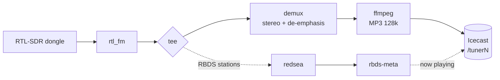

<p align="center">
  <picture>
    <source media="(prefers-color-scheme: dark)" srcset="docs/images/logo-dark.svg">
    
  </picture>
</p>

<p align="center">
  Turn cheap RTL-SDR dongles into internet radio stations.<br>
  A Raspberry Pi, one config file per station, and your own Icecast server.
</p>

<p align="center">
  
  
  
  
  <a href="LICENSE"></a>
</p>

<p align="center">
  <a href="#what-it-does">What it does</a> ·
  <a href="#how-it-works">How it works</a> ·
  <a href="#install-one-line">Install</a> ·
  <a href="#add-and-edit-stations">Stations</a> ·
  <a href="#rbds-now-playing-optional">RBDS</a> ·
  <a href="#configuration-reference">Config</a> ·
  <a href="#troubleshooting">Troubleshooting</a> ·
  <a href="#made-by">Made by</a>
</p>

> [!NOTE]
> **Pi-Tuner is a small, hobby-scale project.** The installer **resets your
> Icecast configuration** (it regenerates the source and admin passwords), so
> back up Icecast first if you already use it for other streams.

## What it does

Plug in a dongle, tune it to a frequency, and it streams that station to your
Icecast server where anyone on your network can listen. No web interface, no
database: just a folder of text config files and one Python program that
systemd keeps running.

| | |
|---|---|
| 📻 **FM and weather radio** | Stereo FM, plus NOAA Weather Radio in mono |
| 🔊 **Icecast streaming** | Every station is a 128k MP3 stream on its own mount: `/tuner1`, `/tuner2`… |
| 🏷️ **RBDS now-playing** | Decodes RadioText and the station name and shows `Artist - Title (PS)` in Icecast |
| ♻️ **Self-healing** | If a dongle is unplugged or a stream dies, that station restarts automatically, with backoff |
| 🚨 **EAS tone detection** | Listens for the 853 + 960 Hz attention tone and alerts you through Zabbix |
| 📟 **Zabbix alerts** | Optional status heartbeat and events, with no agent on the Pi |
| 🧰 **One-line installer** | Installs packages, builds the decoders, configures Icecast and walks you through your first stations |

## How it works



Each station gets its own dongle, `rtl_fm` pipeline and Icecast mount. The
supervisor in `tuner.py` watches every pipeline and restarts any that die.

## What you need

- A Raspberry Pi running Raspberry Pi OS (Debian).
- One RTL-SDR USB dongle per station you want to stream.
- An antenna for each dongle (a cheap telescopic antenna works for FM).

Everything else (the software, the Icecast server, the FM and RBDS decoders) is
installed for you by the installer.

## Install (one line)

Run this on the Pi:

```sh
curl -fsSL https://raw.githubusercontent.com/thetylerwoodwardproject/pi-tuner/main/install.sh -o /tmp/pituner-install.sh && sudo bash /tmp/pituner-install.sh
```

The installer walks you through each step and asks before doing anything:
it installs packages, configures Icecast, guides you through programming your
dongle serials, and helps you set up your first station or two. You don't need
to set up every station now: you can add more any time.

> [!WARNING]
> The installer **resets your Icecast configuration**: it regenerates the
> source and admin passwords and restarts Icecast. Back up first if you already
> use Icecast for other streams.

Prefer to look at the code first? Clone and run instead:

```sh
git clone https://github.com/thetylerwoodwardproject/pi-tuner.git
cd pi-tuner
sudo ./install.sh
```

## Give each dongle a unique serial number

This step matters because **every RTL-SDR dongle ships with the same default
serial number** (usually `00000001`). With two or more plugged in, the Pi can't
tell them apart. Giving each dongle its own serial is what makes them work
reliably: and it only takes a minute per dongle.

Do this **one dongle at a time**:

1. Unplug all dongles, then plug in just **one**.
2. Write a new serial to it:
   ```sh
   sudo rtl_eeprom -d 0 -s 00001001
   ```
3. Unplug it, then plug it back in (the new serial only takes effect after a
   replug).
4. Confirm it worked:
   ```sh
   rtl_test
   ```
   Look for a line like `SN: 00001001`.
5. Repeat for each dongle with a different number: `00001002`, `00001003`, and
   so on.
6. Plug them all back in and check `rtl_test` again: you should see one line
   per dongle, each with its own serial.

Notes:

- `rtl_eeprom` is installed as part of the `rtl-sdr` package (the installer
  installs it for you).
- Any 8-digit number works. Pick a scheme you can remember, e.g. `00001001`,
  `00001002`, …
- Pi-Tuner matches serials by number, so `1001`, `0001001`, and `00001001` are
  all treated as the same dongle.

## Add and edit stations

Every station is one small text file in `stations/`:

```
# ─── user settings ─────────────────────────────────
NAME=My Station
BAND=fm            # fm | wx
FREQUENCY=98.1
SERIAL=00001001
GAIN=40.2          # dB; delete this line for auto-gain
RBDS=true          # optional, fm only; RBDS text -> Icecast now-playing
# ─── end user settings ─────────────────────────────
```

- To **add** a station: drop a new `.conf` file in `stations/`.
- To **change** a station: edit its file.
- To **remove** a station: delete its file.

After changing the files, tell the service to reload: no full restart needed:

```sh
sudo systemctl reload pituner.service
```

Each station's stream is then available at:

```
http://<raspberry-pi-ip>:8000/<mount>
```

## Configuration reference

### Per-station file (`stations/*.conf`)

| Key         | Default         | Meaning                                          |
|-------------|-----------------|--------------------------------------------------|
| `NAME`      | the file name   | Station name shown in your player                |
| `BAND`      | `fm`            | `fm` (stereo) or `wx` (NOAA weather, mono)       |
| `FREQUENCY` |: (required)    | Frequency in MHz (FM 88–108, WX 162.400–162.550) |
| `SERIAL`    |:               | Dongle serial (matched by number)                |
| `GAIN`      | none (auto)     | Tuner gain in dB, e.g. `40.2`                    |
| `RBDS`      | `false`         | FM only: send RBDS text to Icecast now-playing   |
| `MOUNT`     | `/tuner1`, `/tuner2`, … | Icecast mount, numbered in file order    |

### `icecast.conf` (shared)

| Key               | Default     | Meaning                                          |
|-------------------|-------------|--------------------------------------------------|
| `HOST`            | `localhost` | Icecast host                                     |
| `PORT`            | `8000`      | Icecast source port                              |
| `SOURCE_PASSWORD` | `CHANGEME`  | Icecast `<source-password>`                      |
| `ADMIN_USER`      | `admin`     | Optional: admin login for now-playing updates    |
| `ADMIN_PASSWORD`  | none        | Optional: if set, used instead of the source login |

The installer fills these in for you; you normally only touch `icecast.conf` if
you change your Icecast password later.

## Zabbix alerts (optional)

If you run a Zabbix server internally, Pi-Tuner can push station events and a
status heartbeat to it (no agent needed on the Pi).

1. On your Zabbix server, import `zabbix_template.xml`
   (Configuration → Templates → Import).
2. Create a host (e.g. `pituner`) and attach the `Pi-Tuner` template.
3. Edit `zabbix.conf` on the Pi:
   - `ENABLED=true`
   - `SERVER` = your Zabbix server
   - `HOSTNAME` = the host name you created in step 2
4. `sudo systemctl restart pituner.service`

Zabbix being unreachable never affects tuning: sends are best-effort and
logged.

## EAS attention-tone detection (optional)

If Zabbix is enabled, the Pi can listen for the EAS/SAME **attention signal**:
a simultaneous 853 Hz + 960 Hz dual-tone broadcast on FM and NOAA WX before
emergency messages, and alert you when it's heard.

Set `EAS_DETECT=true` in `zabbix.conf` (the default). When the tone is detected
on any FM/WX station, the Pi pushes `pituner.eas = 1` to Zabbix, holds it for
~10 seconds, then resets it to `0`, so a trigger on `last()=1` fires and then
auto-recovers. The station name is logged in `pituner.event`.

Detection is tone-only (it does not decode the SAME data). The thresholds are
constants at the top of `tuner.py` (`EAS_TONE_RATIO`, `EAS_HOLD_SECS`,
`EAS_COOLDOWN_SECS`) if you need to tune them for your signal levels.

## RBDS now-playing (optional)

Most US FM stations broadcast **RBDS** (the North American flavor of RDS), a
tiny data stream hidden in the FM signal. It carries the station's 8-character
**PS** name (e.g. `KXYZ-FM`) and a **RadioText (RT)** line, which is usually the
current artist and title. Pi-Tuner can decode it and show it as the Icecast
"now playing" text, so your player displays something like:

```
Artist - Title (KXYZ-FM)
```

Turn it on per FM station by adding `RBDS=true` to its file (the installer asks
you), then reload:

```sh
sudo systemctl reload pituner.service
```

How it works:

```
rtl_fm ──┬──▶ demux ──▶ ffmpeg ──▶ Icecast  (audio)
         └──▶ redsea ──▶ tuner.py rbds-meta ──▶ Icecast /admin/metadata  (now playing)
```

- The raw 192 kHz FM signal is split before stereo decoding. One copy goes to the
  audio path as usual; the other goes to
  [redsea](https://github.com/windytan/redsea), which decodes RBDS and outputs
  JSON.
- `tuner.py rbds-meta` combines the latest RT and PS into `RT (PS)` and updates
  the stream's metadata on its mount (`/tuner1`, `/tuner2`, …). If a station
  sends only RT or only PS, that one is shown by itself. Only changes are sent.
- The Icecast stream **name** is not changed: it stays the `NAME` from the
  station file. (Icecast only sets the name when a source connects.)
- Updates use the `source` login and `SOURCE_PASSWORD` from `icecast.conf`. To use
  the admin login instead, set `ADMIN_USER` and `ADMIN_PASSWORD` there.
- WX stations have no RBDS, and `RBDS=true` is ignored on them.

To check it's working, open `http://<pi>:8000/status-json.xsl` (look for `title`
on the mount) or watch `tail -f /var/www/pituner/rbds.log`.

Notes:

- RBDS needs a clean signal. Weak or noisy stations may decode slowly or not at
  all; try adjusting `GAIN` and your antenna.
- Some stations send only a PS name and no RadioText, or send ads and station
  slogans in RT instead of song info. Pi-Tuner shows whatever the station sends.
- `redsea` is built from source by the installer. If it isn't installed, a
  station with `RBDS=true` still streams audio normally and a warning is logged;
  RBDS is just skipped.
- Like the EAS detector, the RBDS helper is best-effort and can never interrupt
  the audio.

## Troubleshooting

| Problem                          | Check                                              |
|----------------------------------|----------------------------------------------------|
| Station won't start              | `journalctl -u pituner -f`                         |
| Wrong/no dongle found            | `rtl_test` (check serials)                         |
| Config doesn't parse             | `tuner.py --dir /opt/pituner --check`              |
| No audio / stream missing        | `http://<pi>:8000/status-json.xsl` in a browser    |
| Changes didn't apply             | `sudo systemctl reload pituner.service`            |
| No now-playing text              | `which redsea`, then `tail /var/www/pituner/rbds.log` |

The service automatically restarts any station whose pipeline dies (dongle
unplugged, Icecast unreachable, decode failure), backing off between attempts.

## Local logs

The Pi also keeps rotating logs on disk under `/var/www/pituner/`:

| File         | Contents                                                             |
|--------------|----------------------------------------------------------------------|
| `tuner.log`  | Tuner health: station status changes, restarts, reloads             |
| `eas.log`    | EAS attention-tone detections                                        |
| `zabbix.log` | Mirror of what's sent to Zabbix (events only, not heartbeats)        |
| `rbds.log`   | RBDS now-playing updates sent to Icecast, and any update failures    |

They rotate by size (10 MB, keeping 5 compressed copies) via
`/etc/logrotate.d/pituner`. View them with e.g. `tail -f /var/www/pituner/tuner.log`.

## Project layout

```
/opt/pituner/
  tuner.py            # the whole app (Python standard library only)
  icecast.conf        # shared Icecast connection
  zabbix.conf         # Zabbix trapper settings (optional)
  stations/           # one *.conf file per station
    fm-example.conf
    wx-example.conf
  zabbix_template.xml # import into Zabbix (optional)
  pituner.service     # systemd unit
```

The repository also has `install.sh` / `uninstall.sh`, `logrotate.conf`, a
`tests/` folder (`python3 -m unittest discover -s tests`) and the `docs/images`
used by this README. The installer additionally places the `demux` and `redsea`
decoders in `/usr/local/bin`.

## Uninstall

Remove the service, application files, the `pituner` user, and the `demux`
and `redsea` decoders (system packages are left in place):

```sh
sudo ./uninstall.sh          # asks before removing each thing
sudo ./uninstall.sh --yes    # remove everything without prompting
```

## Made by

<table>
  <tr>
    <td valign="middle">
      Pi-Tuner is made by <b>Tyler Woodward</b>, host of the podcast <a href="https://tylerwoodward.me"><b>The Tyler Woodward Project</b></a>.
      <br><br>
      <a href="https://tylerwoodward.me"></a>
      <a href="https://www.facebook.com/thetylerwoodwardproject"></a>
      <a href="https://www.threads.net/@tylerwoodward.me"></a>
      <a href="https://www.instagram.com/tylerwoodward.me"></a>
    </td>
  </tr>
</table>

## Credits

Pi-Tuner is built on [rtl-sdr](https://osmocom.org/projects/rtl-sdr/wiki),
[FFmpeg](https://ffmpeg.org) and [Icecast](https://icecast.org). Stereo decoding
uses [stereodemux](https://github.com/windytan/stereodemux) and RBDS decoding
uses [redsea](https://github.com/windytan/redsea), both by Oona Räsänen
(windytan).

## Licence

MIT © 2026 [Tyler Woodward](https://tylerwoodward.me). See [LICENSE](LICENSE).
